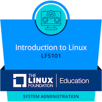
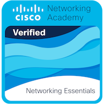
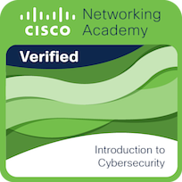

<h1 align="center">
  
  Hi everyone, I'm Kevin  
</h1>

  Computer Science Student at <a href="https://www.epn.edu.ec/">National Polytechnic School (Ecuador)</a> 🏫🇪🇨  

## 👨🏻‍💻 About Me:

I'm a Computer Science student driven by **curiosity** and a desire to master how systems work at all levels—from infrastructure and networks to automation, code, and cloud deployments. While I’m currently leaning toward a future in **SysAdmin**, **Cloud Infrastructure**, or **DevOps Engineering**, I also enjoy diving into areas like **Backend Development**, **Cybersecurity**, and **AI/Machine Learning** as I explore where I can create the most impact.

## 🔍 My Current Focus:

- 🔧 **Linux & Systems Administration:** I use Linux daily (Arch, Fedora, Ubuntu) and enjoy managing services, users, permissions, systemd units, and writing Bash scripts for automation.
- ☁️ **Cloud & DevOps:** Learning cloud fundamentals (especially AWS), Docker, GitHub Actions, and eager to move into Infrastructure as Code (Terraform, Ansible) and CI/CD pipelines.
- 💻 **Backend Development:** Most of my hands-on experience is with **Node.js and Express**, building APIs and server-side logic. I enjoy working on structured backend projects and learning best practices for API design and deployment.
- 🔐 **Cybersecurity (Intro Level):** Familiar with basic networking, firewalls, SSH hardening, and principles of secure system configurations.
- 🤖 **AI & Machine Learning (Exploring):** I've used Python with libraries like Pandas, NumPy, and scikit-learn in small projects to understand ML fundamentals—but it’s not my current focus.
- 🛠️ **Version Control & Tooling:** Git, GitHub, system monitoring tools (htop, netstat), editors like Vim and VSCode.

## 🌱 Growth Mindset:

I don’t claim to be an expert in any one area—yet. What defines me is my commitment to **learn by building, breaking, fixing, and iterating**. I’m not afraid to get my hands dirty in the command line, debug infrastructure issues, or explore a new API just to figure out how it works.

# 🏅 Certifications & Badges:

  
  
  

## 🛠️ Technologies & Tools:

- **Operating Systems:** Arch Linux, Fedora, Ubuntu, Windows  
- **Languages:** JavaScript (Node.js, Express), Bash, Python, C++, Java, LaTeX  
- **Web Tech:** HTML, CSS, React, Node.js, Express, Django (basic), Flask (basic)  
- **Cloud & Infra:** Docker, GitHub Actions, systemd, crontab, SSH, basic AWS  
- **Data & AI:** Pandas, NumPy, scikit-learn, SQL  
- **Cybersecurity (Basic):** SSH, firewalls, network tools (nmap, netstat), secure configs  
- **Version Control:** Git, GitHub  
- **Editors & Tools:** VSCode, Vim, Nano, curl, netcat, htop  

## 💡 Fun Fact:

I don’t just use open-source software—I enjoy tweaking it, breaking it, and learning how to make it better. If I can automate it, I will.

---

Feel free to check out my repositories below and reach out if you're working on something cool related to systems, backend, or cloud—I’m always looking for projects to grow with!

  

